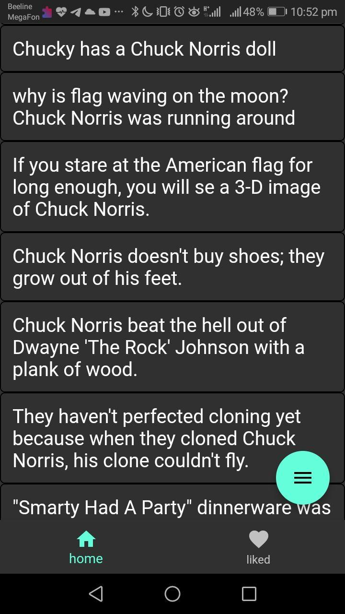
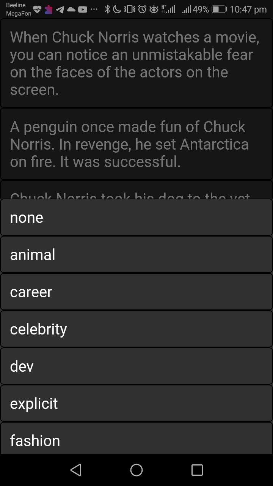
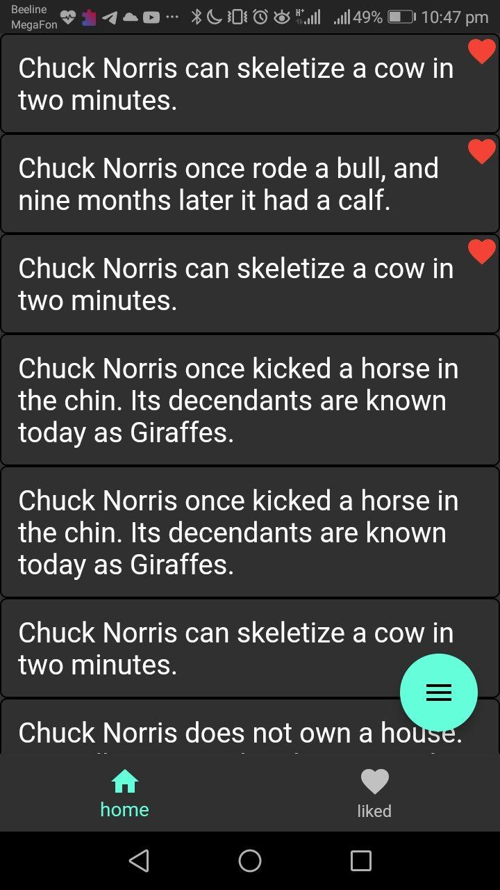
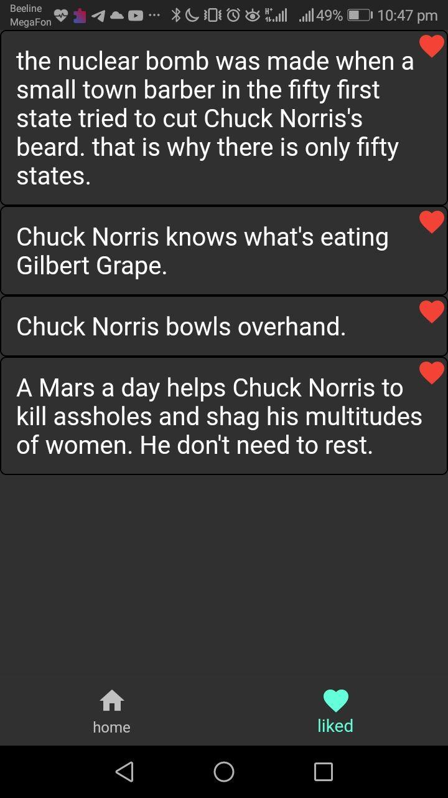

# Joke_Jokkes

### by Valentin Chernyshov

## Description:

This is a simple android app written with Flutter that uses api.chucknorris.io to display jokes about Chack Norris generated by this API.  
Jokes are showed in a format of an infinite list (simular to Reddit home page)  
One also can choose a category of jokes he want to read and save best jokes on its device by double tapping it.

## Screenshots:









## How to Build:

App can be builded as any flutter project
```
flutter build apk --split-per-abi
```

## How to run:

after build is complited you can find .apk file in `build/app/outputs/flutter-apk` and install it on your device. Also one can find last realise .apk in root directory

## Known issue:

- when category is chosen jokes that currently displayed wont change untill its tile rebuilded (you need to scroll down and back to the tile in order to update it)
